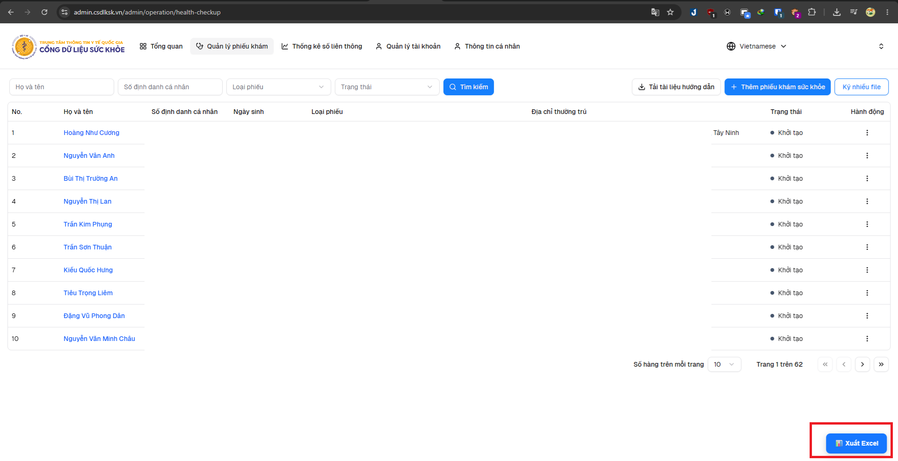

# Zakshin CSDL KSK - Xuất Excel danh sách khám sức khỏe

Công cụ hỗ trợ **xuất toàn bộ danh sách khám sức khỏe từ CSDL KSK ra file Excel (`.xlsx`)**.




---

# Cách 1 - Cài Userscript bằng Violentmonkey qua URL

> **Khuyến nghị sử dụng cách này** vì chỉ cần cài một lần và có thể cập nhật script thuận tiện hơn.

Hỗ trợ:

* Violentmonkey
* Tampermonkey
* Các trình quản lý Userscript tương thích

## Bước 1 - Cài Violentmonkey

Cài extension **Violentmonkey** trên Chrome, Edge hoặc Firefox.

Sau khi cài xong, mở:

```text
Violentmonkey → Dashboard
```

## Bước 2 - Cài script bằng URL

Trong Violentmonkey chọn chức năng:

```text
Install from URL
```

Sau đó nhập URL:

```text
https://raw.githubusercontent.com/ZakShinn/Zakshin_csdlksk/refs/heads/main/script.user.js
```

Nhấn cài đặt để thêm Userscript.

## Bước 3 - Kiểm tra script

Sau khi cài xong, đảm bảo script đang ở trạng thái:

```text
Enabled
```

Script chạy trên toàn bộ `https://admin.csdlksk.vn/*`. Nút xuất chỉ hiện khi vào trang Health Checkup (kể cả điều hướng SPA từ trang khác).

## Bước 4 - Sử dụng

Đăng nhập CSDL KSK rồi mở trang Health Checkup (có thể vào trực tiếp hoặc điều hướng từ menu):

```text
https://admin.csdlksk.vn/admin/operation/health-checkup
```

Sau khi vào đúng trang sẽ xuất hiện nút:

```text
📊 Xuất Excel
```

Nhấn **Xuất Excel**.


---

# Cách 2 - Chạy trực tiếp bằng F12 Console

Cách này không cần cài Violentmonkey.

Phù hợp khi:

* Chỉ cần sử dụng tạm thời.
* Không muốn cài extension.
* Muốn chạy trực tiếp bằng Developer Tools của trình duyệt.

Script Console được lưu tại:

```text
https://raw.githubusercontent.com/ZakShinn/Zakshin_csdlksk/refs/heads/main/f12-console
```

## Bước 1 - Đăng nhập

Đăng nhập CSDL KSK và truy cập:

```text
https://admin.csdlksk.vn/admin/operation/health-checkup
```

## Bước 2 - Mở Developer Tools

Nhấn:

```text
F12
```

hoặc:

```text
Ctrl + Shift + I
```

Sau đó chọn tab:

```text
Console
```

Có thể mở trực tiếp Console bằng:

```text
Ctrl + Shift + J
```

## Bước 3 - Sao chép script

Mở file:

```text
https://raw.githubusercontent.com/ZakShinn/Zakshin_csdlksk/refs/heads/main/f12-console
```

Sao chép toàn bộ nội dung.

## Bước 4 - Chạy script

Quay lại:

```text
F12 → Console
```

Dán toàn bộ script vào Console.

Nhấn:

```text
Enter
```

Script sẽ bắt đầu chạy.

Sau khi hoàn tất, file Excel sẽ tự động được tải về máy.

## Lưu ý khi dán code vào Console

Một số phiên bản Chrome/Edge có thể không cho phép dán code vào Console ngay lần đầu và hiển thị cảnh báo bảo mật.

Nếu đây là máy của bạn và bạn đã kiểm tra nội dung script, làm theo hướng dẫn của DevTools để cho phép thao tác dán rồi thực hiện lại.


---


# Xử lý lỗi

## Không xuất hiện nút Xuất Excel

Kiểm tra:

```text
1. Violentmonkey đã được bật.
2. Script đã được Enable (phiên bản ≥ 1.9.8, @match = https://admin.csdlksk.vn/*).
3. Đang ở trang Health Checkup (pathname chứa /admin/operation/health-checkup).
4. Nếu vừa cập nhật script: tắt/bật lại script hoặc reload bằng Ctrl + F5.
```

## Không tìm thấy Access Token

Thử:

```text
Đăng xuất → Đăng nhập lại → Mở lại Health Checkup → Chạy lại script
```

## Báo 401 Unauthorized

Thông thường do Access Token đã hết hạn.

Thực hiện:

```text
Đăng nhập lại CSDL KSK
```

sau đó thử xuất lại.

## File Excel thiếu dữ liệu

Kiểm tra thông báo tiến trình hoặc Console xem có trang nào tải thất bại hay không.

Script có cơ chế thử lại request khi xảy ra lỗi tạm thời.


---

# License

This project is released under the **GNU General Public License v3.0 (GPL-3.0)**.
